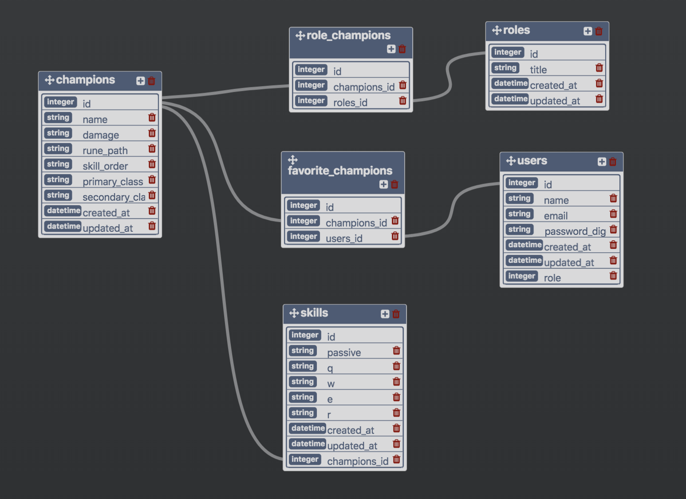

# SmartSummon

[](https://waffle.io/Autumn-Martin/smart_summon)

### About

##### Intro
This app will serve League of Legends players. These users quickly decide which champions to play and what runes they will have based on a number of conditions, but ultimately based on the player's role and what the player enjoys playing. This app will help players quickly see info based on their role and favorite champions to pick runes, item-builds, ect and also see personal notes. 

##### Background
The app would be meant for a single user.  A user would initially create an account, login, and select their favorite champions. Then, when the game starts, they could select their role from the main index page, which would take them to a page displaying their favorite champs for that role. And then, they could click on a champion to view a show page with that champs info. This page would also include a field for adding notes on a champion, as well as a list of notes from most recent to least recent (which a user could view while the game is loading). If a user hasn't played for a bit, is new, or plays many different champs, all that can be hard to keep track of. This would especially make the game more accessible to new players.

authorization: 
The user will be authorized to add/edit/delete notes on their favorite champions. Only the admin can add/delete champions in the database. The user will pick their favorite champions from a dropdown. 

user story: 
As a user, when I visit '/roles',  and I click on a role, I am taken to a show page for that role that includes a list of champions for that role. 

user story: 
As a user, when I visit '/champions/show' I see the best items, runes, skill order, and notes for a champion. 

relationships:
many champions to many roles
one champion to many notes

### Getting Started

This project uses the Ruby on Rails framework version 5.1.6, which can be installed [here](http://installrails.com/).
[Bundler](http://bundler.io/) is used to install the gems needed for this application.

In order to run this appication in the development environment, perform the following in the CLI:

```
bundle install
rake db:create db:migrate db:seed
```

In order to spin-up the server, run: `rails s`d

### Learning Goals
User Experience
* The application has been styled.
* The application uses a balanced, considered color scheme.
* The application implements a font (that is not the default font).
* The application utilizes a nav bar.
* The style shows evidence of intentional layout.
* Space and text is balanced. White space is used to visually separate content.
* The application is easily usable. The user can intuitively navigate between different portions of the application without manually entering the URL into the nav-bar or using the back button on their browser.
Database
* Properly implements a one-to-many relationship
* Properly implements a many-to-many relationship
* Utilizes primary and foreign keys appropriately
Code Quality
* Logic lives in the appropriate files
* Methods are refactored and follow SRP
* Naming follows convention
Testing
* Project has a running test suite
* Test suite includes robust feature tests
* Test suite includes tests for validations
* Test suite includes tests for methods that they have created on the models

### Database

The following schema was used to create a [PostgreSQL](https://www.postgresql.org/) database:



### Testing

[Rspec-Rails](https://github.com/rspec/rspec-rails) is used for testing. [FactoryBot](https://github.com/thoughtbot/factory_bot_rails) is used to create test data, and [Shoulda Matchers 3.1](https://github.com/thoughtbot/shoulda-matchers) is used to test validations on the models.

In order to run tests, perform the following:

`rake db:test:prepare`

`rspec`

### References

Database:
[Google Drive CSV Spreadsheet](https://docs.google.com/spreadsheets/d/1B1okEW0fUA5g14dhsm5iCaUiDanxEIOD5RMF5rORixI/edit#gid=0)
[CSV Author](https://www.reddit.com/user/henrebotha)
